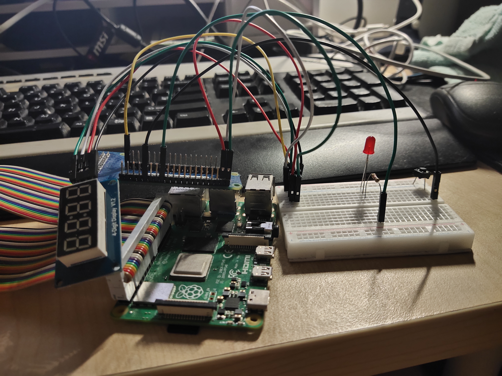

# raspberry-pi-counter-ticketing-system

Demo - https://youtu.be/Z1RTgT2WfTw

Slide - https://docs.google.com/presentation/d/1XbFPbw-MDkFkPCpH4sTNc8vwm9ccu7jz/edit#slide=id.p1

## Overview
To use Raspberry Pi to build and simulate Counter Ticketing System

Counter Ticketing System has the following flow:
1. People queue to wait for their turn
2. Counter takes time to serve the person
3. Once the person has been served, the next person in the queue to be served next
4. The cycle repeats
5. Until there's no more person in a queue.

The raspberry pi is built to simulate the scenario
1. Whenever a Push button is pressed, it will push one data into the queue.
2. Digital Clock will then be incremented by 1.
3. This signifies that there is one person in the queue. That is, 'data' means 'person' here.
4. The system will check if there is data inserted into the queue in a forever loop.
5. If there is data inserted into the queue, it will dequeue and process the data.
6. Each data takes 5s to process.
7. In the meantime, the LED will light up.
8. Once 5s is passed, the Digital Clock will decrement by 1.
9. If Digital Clock shows 0000, LED will be turned off.

## Hardwares
1. Digital Clock - to show how many person in a queue
2. LED - decoration, lights up whenever Digital Clock shows number more than 0.
3. Button - For user interaction. Click 1 time == insert 1 person into the queue
